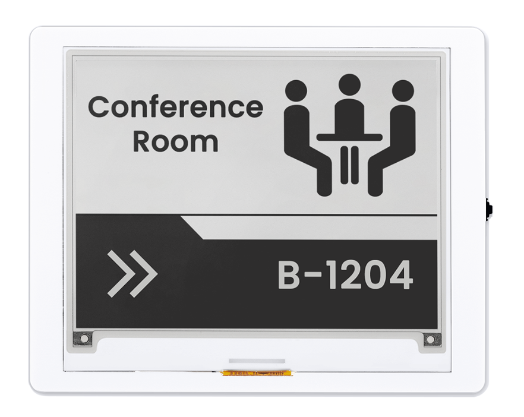
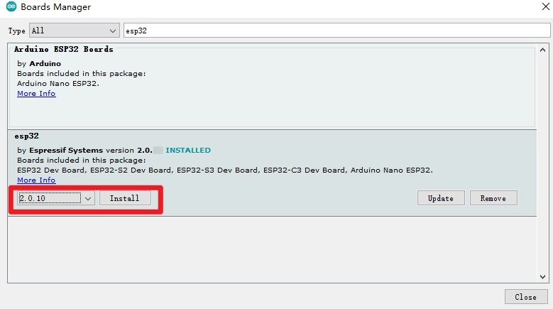

### 1, Product picture

### 2, Product version number

|      | Hardware | Software | Remark |
| ---- | -------- | -------- | ------ |
| 1    | V1.0     | V1.0     | latest |

### 3, product information

- # Display Module Specifications

  - **Size**: 4.2 inch

  - **MCU**: ESP32-S3-WROOM-1-N8R8, up to 240 MHz

  - **Flash**: 8 MB

  - **PSRAM**: 8 MB

  - **Material**: Active Matrix Electrophoretic Display (AM EPD)

  - **Driver Chip**: SSD1683

  - **Resolution**: 400(H)*300(V) Pixel

  - **Pixel Pitch**: 0.212*0.212

  - **Viewing Angle**: Full Viewing Angle

  - **Communication Interface**: 3-/4-wire SPI

  - **Interface**:
    - UART0 x1
    - BAT x1
    - GPIO x1
    - TF Card Slot x1

  - **Button**:
    - Rotary Switch x1,
    - Menu Button x1, 
    - EXIT Button x1, 
    - REST Button x1, 
    - BOOT Button x1

  - **Development Environment**: Arduino IDE、ESP IDF、MicroPython

  - **Display Color**: Black and white

  - **Refresh Mode**: Partial refresh (saves more power)

  - **Display Operation Voltage**: 2.2~3.7V

  - **Operation Temperature**: -0~50℃

  - **Storage Temperature**: -25~70℃

  - **Active Area**: 84.8(H)\*63.6(L) (H*L)

### 4, Use the driver module

| Name    | dependency library     |
| ------- | ---------------------- |
| SSD1683 | EPD version=1.0.0 |

### 5,Quick Start

##### Arduino IDE starts

1.Download the library files used by this product to the 'libraries' folder.

C:\Users\Documents\Arduino\libraries\

2.Open the Arduino IDE

3.Open the code configuration environment and burn it

### 6,Folder structure.

|--3D file： Contains 3D model files (.stp) for the hardware. These files can be used for visualization, enclosure design, or integration into CAD software.

|--Datasheet: Includes datasheets for components used in the project, providing detailed specifications, electrical characteristics, and pin configurations.

|--Eagle_SCH&PCB: Contains **Eagle CAD** schematic (`.sch`) and PCB layout (`.brd`) files. These are used for circuit design and PCB manufacturing.

|--example: Provides example code and projects to demonstrate how to use the hardware and libraries. These examples help users get started quickly.

|--factory_firmware: Stores pre-compiled factory firmware that can be directly flashed onto the device. This ensures the device runs the default functionality.

|--factory_sourcecode: Contains the source code for the factory firmware, allowing users to modify and rebuild the firmware as needed.

### 7,Pin definition

#define SCK 12

#define MOSI 11

#define RES 47

#define DC 46

#define CS 45

#define BUSY 48

## Create Images

[Image2cpp](https://javl.github.io/image2cpp/)
